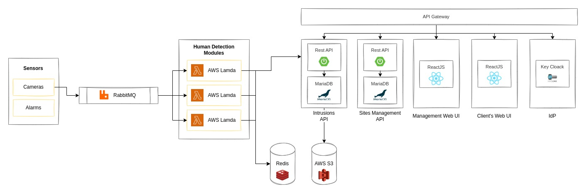

# Architectural View

## Architecture Description

The data provided by our client’s cameras will be forwarded to a Message Broker that will be responsible for delivering the frames to our Human Detection Module. This Message Queue will be implemented using **RabbitMQ.** 

The Human Detection Module needs to be scalable and able to handle periods with a huge amount of data being received, as well as reduce the number of resources being used on periods with fewer data. To handle this, we will be using the AWS serverless solution - **AWS Lambda**, which will run the Human Detection algorithms and alert our clients - through the **Intrusions API** - whenever an intrusion is detected. These Lambda functions will be able to modify a **Redis** database that will keep track of the frames where a human is detected. 

The Intrusions API and Sites Management API will be developed using **Spring Boot** and **MariaDB** as databases. Our UIs will be developed using React JS. We will use KeyCloak as our IdP (Identity Provider) to help us implement authentication and authorization mechanisms for our system.

## Architecture Diagram

