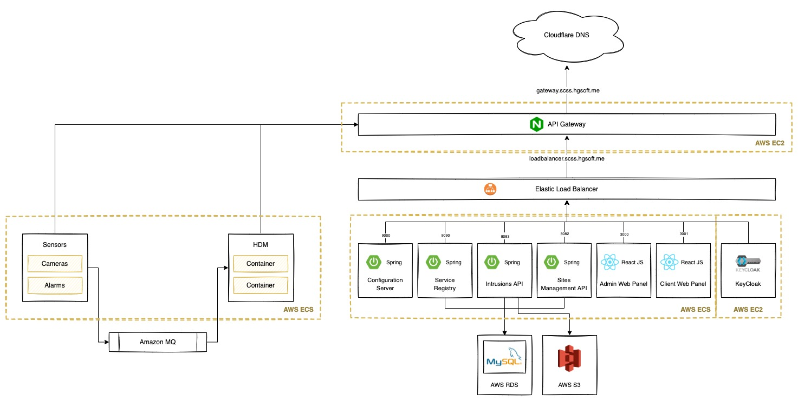

# Architectural View

## Architecture Description

Compared to the [Architecture V1](../v1/architectural_view.md), this version includes more details about the deployment technologies that were used to deploy the different components of our system. Two more service were also added to our architecture and the Redis database was removed as we will not need it anymore.

The First component that was added was the **Service Registry**. The Service Registry is a very important component in our architecture as it allows the remaining micro-services to register themselves and to check the status of the remaining ones and obtain more details about them as, for example, the address they should use to contact a certain micro-service in the network. The second important feature of the Service Registry is that it is capable of attributing a unique ID to each one of the micro-services. This is very important as, for example, the cameras can obtain a unique ID that identify them and allow other services to know exactly to which camera they are "talking" with.  

The Second component added was a **Configuration Server**. It was implemented using Spring Cloud, and allow us to set the configurations for our applications in a centralized place and update them when needed. These updates will automatically reflect in our services without the need to restart them! 

Besides the components added, we decided to deploy all of our micro-services using **AWS ECS** and **AWS Fargate** technologies. This creates an important break-through in the scalability of our system allowing it to be as much scalable as possible. Once all of our components are *stateless* - do not store data locally - the use of ECS means that we can, in moments with a higher peak of usage, deploy more services to handle the user's requests and decrease the amount of services when our system is not being used that much.

## Architecture Diagram

